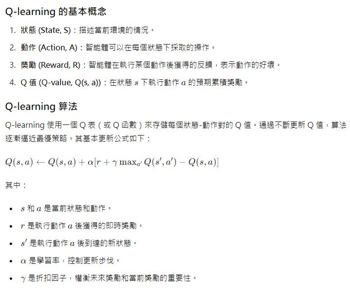
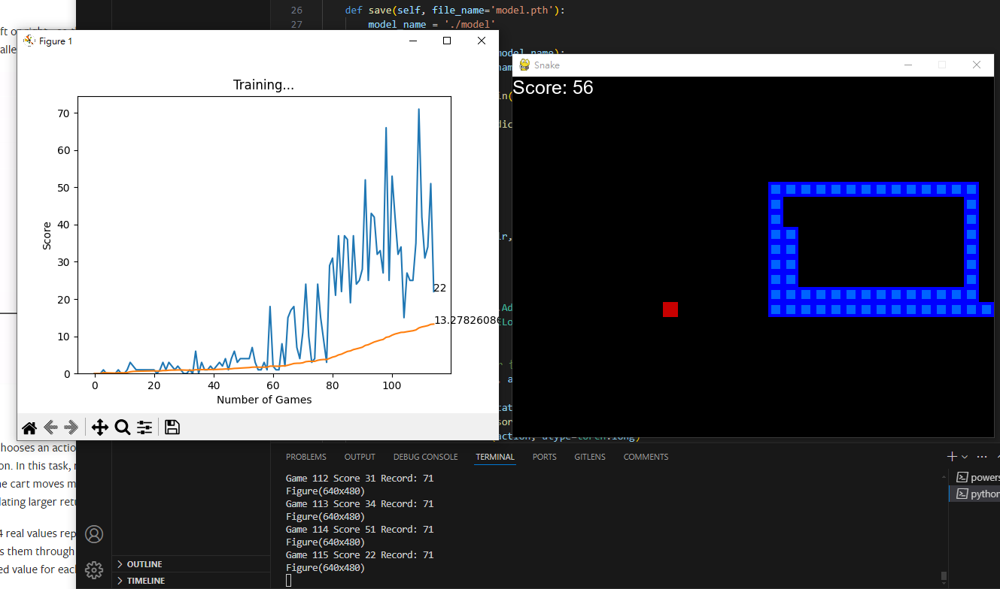
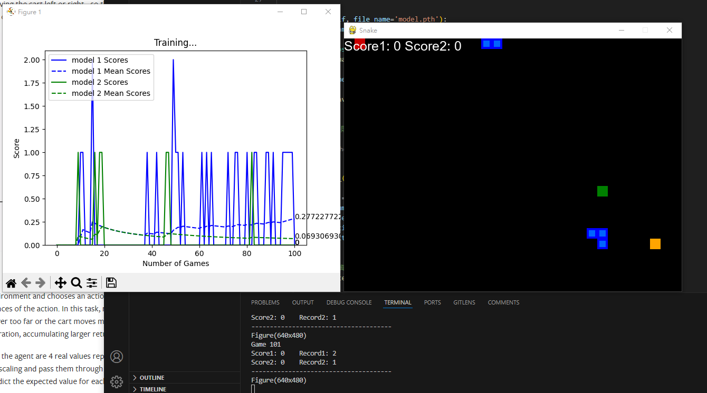

## 強化學習 貪食蛇遊戲

### 主要使用套件:

pytorch 和 裡面的 Q-learning 庫 ，pygame

[pytorch的強化學習](https://pytorch.org/tutorials/intermediate/reinforcement_q_learning.html?highlight=concatenate)

### 專案參考別人編寫:

[貪食蛇遊戲](https://github.com/patrickloeber/python-fun/tree/master/snake-pygame)

[原版教學](https://www.youtube.com/watch?v=L8ypSXwyBds)

[Q-learning 知識參考](https://medium.com/pyladies-taiwan/reinforcement-learning-%E9%80%B2%E9%9A%8E%E7%AF%87-deep-q-learning-26b10935a745)

[神經網路](https://www.cnblogs.com/zhaopengpeng/p/13668727.html)

Q-learning 是一種強化學習算法 基礎概念如下

### 主要修改部分

improve 主要是把 神經網路進行簡化的動作

compete 主要是增加第二條蛇到環境裡，並且食物數量調整為三個，再第二條蛇的神經網路中的每個隱藏層都加入 dropout 層 使其不要太過擬和

### 輸出 :

簡化神經網路

兩個模型競爭

