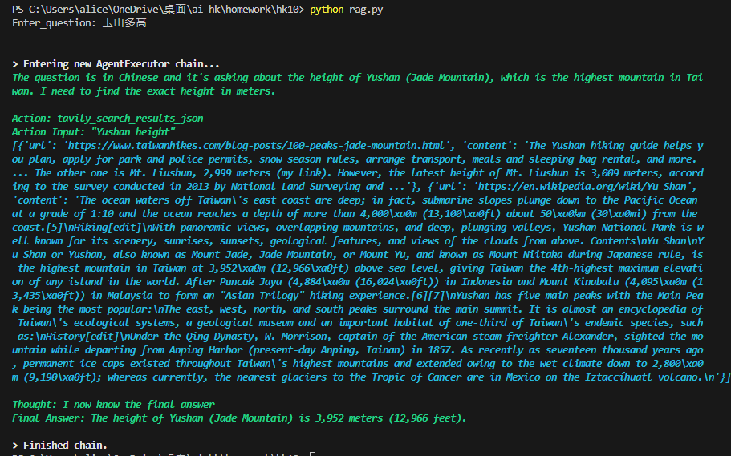

## 使用 langchain 完成 ， 參考官方文件 ，搜索使用 內建 Tavily ， 生成一樣使用 groq

[langchain]:https://python.langchain.com/v0.2/docs/introduction/

[groq文件]:https://python.langchain.com/v0.2/docs/integrations/chat/groq/

[tavily文件]:https://python.langchain.com/v0.2/docs/integrations/tools/tavily_search/#chaining

輸出 :

