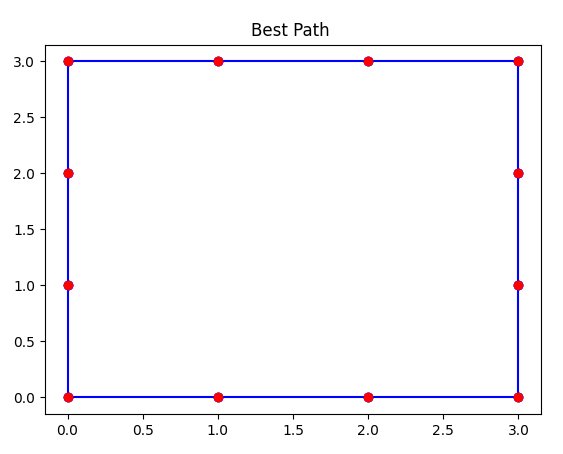

## 參考老師專案更改，使用通用框架爬山演算法編寫

[修改前專案 tsp.py](https://github.com/ccc112b/py2cs/blob/master/03-%E4%BA%BA%E5%B7%A5%E6%99%BA%E6%85%A7/02-%E5%84%AA%E5%8C%96%E7%AE%97%E6%B3%95/01-%E5%82%B3%E7%B5%B1%E5%84%AA%E5%8C%96%E6%96%B9%E6%B3%95/01-%E5%84%AA%E5%8C%96/01-%E7%88%AC%E5%B1%B1%E6%BC%94%E7%AE%97%E6%B3%95/03-%E9%80%9A%E7%94%A8%E7%9A%84%E7%88%AC%E5%B1%B1%E6%A1%86%E6%9E%B6/tsp.py)

[老師專案_通用爬山演算法](https://github.com/ccc112a/py2cs/blob/master/03-%E4%BA%BA%E5%B7%A5%E6%99%BA%E6%85%A7/02-%E5%84%AA%E5%8C%96%E7%AE%97%E6%B3%95/01-%E5%82%B3%E7%B5%B1%E5%84%AA%E5%8C%96%E6%96%B9%E6%B3%95/01-%E5%84%AA%E5%8C%96/01-%E7%88%AC%E5%B1%B1%E6%BC%94%E7%AE%97%E6%B3%95/03-%E9%80%9A%E7%94%A8%E7%9A%84%E7%88%AC%E5%B1%B1%E6%A1%86%E6%9E%B6/hillClimbing.py)

輸出 :

最初的路線

最終的路線

爬山演算法過程

