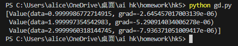

## 參考老師提供專案編寫

添加老師之前的梯度下降法

使用 gdArray 專案 做測試

[gd.py](https://github.com/ccc112b/py2cs/blob/master/03-%E4%BA%BA%E5%B7%A5%E6%99%BA%E6%85%A7/02-%E5%84%AA%E5%8C%96%E7%AE%97%E6%B3%95/02-%E6%B7%B1%E5%BA%A6%E5%AD%B8%E7%BF%92%E5%84%AA%E5%8C%96/03-%E6%A2%AF%E5%BA%A6%E4%B8%8B%E9%99%8D%E6%B3%95/gd.py)

[engine.py](https://github.com/ccc112a/py2cs/blob/master/03-%E4%BA%BA%E5%B7%A5%E6%99%BA%E6%85%A7/02-%E5%84%AA%E5%8C%96%E7%AE%97%E6%B3%95/02-%E6%B7%B1%E5%BA%A6%E5%AD%B8%E7%BF%92%E5%84%AA%E5%8C%96/04-%E5%8F%8D%E5%82%B3%E9%81%9E%E7%AE%97%E6%B3%95/02-%E6%A2%AF%E5%BA%A6%E5%BC%95%E6%93%8E/micrograd/engine.py)

輸出 :

