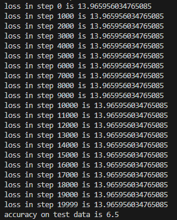

## 參考老師提供專案編寫

engine.py 新增 cross_entropy 層

mnist.py 增加 accuracy

[mnist.py 專案](https://github.com/ccc112b/py2gpt/blob/master/03b-MacroGrad/mnist.py)
[engine.py 專案](https://github.com/newcodevelop/micrograd/blob/master/micrograd/engine.py)

輸出 :

