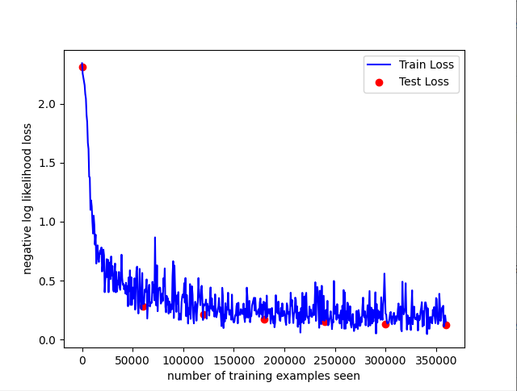

## 參考老師專案修改參數

指令在 run.sh 裡

[老師專案](https://github.com/ccc112b/py2cs/tree/master/03-%E4%BA%BA%E5%B7%A5%E6%99%BA%E6%85%A7/05-%E7%A5%9E%E7%B6%93%E7%B6%B2%E8%B7%AF/02-%E6%B7%B1%E5%BA%A6%E5%AD%B8%E7%BF%92/01-MNIST)

輸出 :

Test set: Avg. loss: 0.1222, Accuracy: 9626/10000 (96%)



```
Train Epoch: 1 [0/60000 (0%)]   Loss: 2.342526
Train Epoch: 1 [640/60000 (1%)] Loss: 2.255051
Train Epoch: 1 [1280/60000 (2%)]        Loss: 2.221936
Train Epoch: 1 [1920/60000 (3%)]        Loss: 2.184515
Train Epoch: 1 [2560/60000 (4%)]        Loss: 2.156577
Train Epoch: 1 [3200/60000 (5%)]        Loss: 2.081820
Train Epoch: 1 [3840/60000 (6%)]        Loss: 2.041936
Train Epoch: 1 [4480/60000 (7%)]        Loss: 1.904863
Train Epoch: 1 [5120/60000 (9%)]        Loss: 1.842081
Train Epoch: 1 [5760/60000 (10%)]       Loss: 1.667169
Train Epoch: 1 [6400/60000 (11%)]       Loss: 1.616100
Train Epoch: 1 [7040/60000 (12%)]       Loss: 1.379696
Train Epoch: 1 [7680/60000 (13%)]       Loss: 1.375111
Train Epoch: 1 [8320/60000 (14%)]       Loss: 1.099556
Train Epoch: 1 [8960/60000 (15%)]       Loss: 1.179802
Train Epoch: 1 [9600/60000 (16%)]       Loss: 1.128860
Train Epoch: 1 [10240/60000 (17%)]      Loss: 1.000182
Train Epoch: 1 [10880/60000 (18%)]      Loss: 0.898304
Train Epoch: 1 [11520/60000 (19%)]      Loss: 1.050620
Train Epoch: 1 [12160/60000 (20%)]      Loss: 0.972543
Train Epoch: 1 [12800/60000 (21%)]      Loss: 0.804960
Train Epoch: 1 [13440/60000 (22%)]      Loss: 0.890028
Train Epoch: 1 [14080/60000 (23%)]      Loss: 0.644321
Train Epoch: 1 [14720/60000 (25%)]      Loss: 0.715831
Train Epoch: 1 [15360/60000 (26%)]      Loss: 0.799200
Train Epoch: 1 [16000/60000 (27%)]      Loss: 0.687307
Train Epoch: 1 [16640/60000 (28%)]      Loss: 0.658250
Train Epoch: 1 [17280/60000 (29%)]      Loss: 0.726733
Train Epoch: 1 [17920/60000 (30%)]      Loss: 0.757605
Train Epoch: 1 [18560/60000 (31%)]      Loss: 0.727170
Train Epoch: 1 [19200/60000 (32%)]      Loss: 0.781498
Train Epoch: 1 [19840/60000 (33%)]      Loss: 0.576824
Train Epoch: 1 [20480/60000 (34%)]      Loss: 0.638447
Train Epoch: 1 [21120/60000 (35%)]      Loss: 0.763030
Train Epoch: 1 [21760/60000 (36%)]      Loss: 0.714219
Train Epoch: 1 [22400/60000 (37%)]      Loss: 0.402015
Train Epoch: 1 [23040/60000 (38%)]      Loss: 0.505891
Train Epoch: 1 [23680/60000 (39%)]      Loss: 0.545623
Train Epoch: 1 [24320/60000 (41%)]      Loss: 0.681906
Train Epoch: 1 [24960/60000 (42%)]      Loss: 0.528305
Train Epoch: 1 [25600/60000 (43%)]      Loss: 0.678220
Train Epoch: 1 [26240/60000 (44%)]      Loss: 0.401606
Train Epoch: 1 [26880/60000 (45%)]      Loss: 0.616452
Train Epoch: 1 [27520/60000 (46%)]      Loss: 0.653851
Train Epoch: 1 [28160/60000 (47%)]      Loss: 0.513220
Train Epoch: 1 [28800/60000 (48%)]      Loss: 0.705230
Train Epoch: 1 [29440/60000 (49%)]      Loss: 0.542556
Train Epoch: 1 [30080/60000 (50%)]      Loss: 0.623865
Train Epoch: 1 [30720/60000 (51%)]      Loss: 0.426423
Train Epoch: 1 [31360/60000 (52%)]      Loss: 0.406889
Train Epoch: 1 [32000/60000 (53%)]      Loss: 0.566029
Train Epoch: 1 [32640/60000 (54%)]      Loss: 0.645390
Train Epoch: 1 [33280/60000 (55%)]      Loss: 0.401316
Train Epoch: 1 [33920/60000 (57%)]      Loss: 0.573679
Train Epoch: 1 [34560/60000 (58%)]      Loss: 0.406811
Train Epoch: 1 [35200/60000 (59%)]      Loss: 0.496740
Train Epoch: 1 [35840/60000 (60%)]      Loss: 0.466121
Train Epoch: 1 [36480/60000 (61%)]      Loss: 0.573774
Train Epoch: 1 [37120/60000 (62%)]      Loss: 0.447717
Train Epoch: 1 [37760/60000 (63%)]      Loss: 0.421976
Train Epoch: 1 [38400/60000 (64%)]      Loss: 0.530483
Train Epoch: 1 [39040/60000 (65%)]      Loss: 0.719952
Train Epoch: 1 [39680/60000 (66%)]      Loss: 0.524517
Train Epoch: 1 [40320/60000 (67%)]      Loss: 0.464028
Train Epoch: 1 [40960/60000 (68%)]      Loss: 0.473609
Train Epoch: 1 [41600/60000 (69%)]      Loss: 0.424906
Train Epoch: 1 [42240/60000 (70%)]      Loss: 0.461306
Train Epoch: 1 [42880/60000 (71%)]      Loss: 0.389942
Train Epoch: 1 [43520/60000 (72%)]      Loss: 0.482035
Train Epoch: 1 [44160/60000 (74%)]      Loss: 0.382779
Train Epoch: 1 [44800/60000 (75%)]      Loss: 0.454872
Train Epoch: 1 [45440/60000 (76%)]      Loss: 0.282843
Train Epoch: 1 [46080/60000 (77%)]      Loss: 0.527800
Train Epoch: 1 [46720/60000 (78%)]      Loss: 0.410043
Train Epoch: 1 [47360/60000 (79%)]      Loss: 0.587706
Train Epoch: 1 [48000/60000 (80%)]      Loss: 0.293803
Train Epoch: 1 [48640/60000 (81%)]      Loss: 0.528823
Train Epoch: 1 [49280/60000 (82%)]      Loss: 0.294364
Train Epoch: 1 [49920/60000 (83%)]      Loss: 0.443145
Train Epoch: 1 [50560/60000 (84%)]      Loss: 0.346606
Train Epoch: 1 [51200/60000 (85%)]      Loss: 0.390278
Train Epoch: 1 [51840/60000 (86%)]      Loss: 0.519663
Train Epoch: 1 [52480/60000 (87%)]      Loss: 0.253854
Train Epoch: 1 [53120/60000 (88%)]      Loss: 0.447231
Train Epoch: 1 [53760/60000 (90%)]      Loss: 0.581476
Train Epoch: 1 [54400/60000 (91%)]      Loss: 0.618746
Train Epoch: 1 [55040/60000 (92%)]      Loss: 0.312519
Train Epoch: 1 [55680/60000 (93%)]      Loss: 0.221050
Train Epoch: 1 [56320/60000 (94%)]      Loss: 0.318985
Train Epoch: 1 [56960/60000 (95%)]      Loss: 0.600180
Train Epoch: 1 [57600/60000 (96%)]      Loss: 0.428914
Train Epoch: 1 [58240/60000 (97%)]      Loss: 0.264184
Train Epoch: 1 [58880/60000 (98%)]      Loss: 0.256571
Train Epoch: 1 [59520/60000 (99%)]      Loss: 0.564795

Test set: Avg. loss: 0.2851, Accuracy: 9164/10000 (92%)

Train Epoch: 2 [0/60000 (0%)]   Loss: 0.307332
Train Epoch: 2 [640/60000 (1%)] Loss: 0.302977
Train Epoch: 2 [1280/60000 (2%)]        Loss: 0.303274
Train Epoch: 2 [1920/60000 (3%)]        Loss: 0.422466
Train Epoch: 2 [2560/60000 (4%)]        Loss: 0.401871
Train Epoch: 2 [3200/60000 (5%)]        Loss: 0.438363
Train Epoch: 2 [3840/60000 (6%)]        Loss: 0.510628
Train Epoch: 2 [4480/60000 (7%)]        Loss: 0.178266
Train Epoch: 2 [5120/60000 (9%)]        Loss: 0.295223
Train Epoch: 2 [5760/60000 (10%)]       Loss: 0.421432
Train Epoch: 2 [6400/60000 (11%)]       Loss: 0.465247
Train Epoch: 2 [7040/60000 (12%)]       Loss: 0.280539
Train Epoch: 2 [7680/60000 (13%)]       Loss: 0.304292
Train Epoch: 2 [8320/60000 (14%)]       Loss: 0.317149
Train Epoch: 2 [8960/60000 (15%)]       Loss: 0.312136
Train Epoch: 2 [9600/60000 (16%)]       Loss: 0.489999
Train Epoch: 2 [10240/60000 (17%)]      Loss: 0.402640
Train Epoch: 2 [10880/60000 (18%)]      Loss: 0.464301
Train Epoch: 2 [11520/60000 (19%)]      Loss: 0.332723
Train Epoch: 2 [12160/60000 (20%)]      Loss: 0.866638
Train Epoch: 2 [12800/60000 (21%)]      Loss: 0.449351
Train Epoch: 2 [13440/60000 (22%)]      Loss: 0.288322
Train Epoch: 2 [14080/60000 (23%)]      Loss: 0.630202
Train Epoch: 2 [14720/60000 (25%)]      Loss: 0.240324
Train Epoch: 2 [15360/60000 (26%)]      Loss: 0.407052
Train Epoch: 2 [16000/60000 (27%)]      Loss: 0.434334
Train Epoch: 2 [16640/60000 (28%)]      Loss: 0.441854
Train Epoch: 2 [17280/60000 (29%)]      Loss: 0.438714
Train Epoch: 2 [17920/60000 (30%)]      Loss: 0.304791
Train Epoch: 2 [18560/60000 (31%)]      Loss: 0.322644
Train Epoch: 2 [19200/60000 (32%)]      Loss: 0.390097
Train Epoch: 2 [19840/60000 (33%)]      Loss: 0.327210
Train Epoch: 2 [20480/60000 (34%)]      Loss: 0.521637
Train Epoch: 2 [21120/60000 (35%)]      Loss: 0.453128
Train Epoch: 2 [21760/60000 (36%)]      Loss: 0.603636
Train Epoch: 2 [22400/60000 (37%)]      Loss: 0.277960
Train Epoch: 2 [23040/60000 (38%)]      Loss: 0.231300
Train Epoch: 2 [23680/60000 (39%)]      Loss: 0.371165
Train Epoch: 2 [24320/60000 (41%)]      Loss: 0.298803
Train Epoch: 2 [24960/60000 (42%)]      Loss: 0.349688
Train Epoch: 2 [25600/60000 (43%)]      Loss: 0.219847
Train Epoch: 2 [26240/60000 (44%)]      Loss: 0.323528
Train Epoch: 2 [26880/60000 (45%)]      Loss: 0.258817
Train Epoch: 2 [27520/60000 (46%)]      Loss: 0.230241
Train Epoch: 2 [28160/60000 (47%)]      Loss: 0.300021
Train Epoch: 2 [28800/60000 (48%)]      Loss: 0.256580
Train Epoch: 2 [29440/60000 (49%)]      Loss: 0.539339
Train Epoch: 2 [30080/60000 (50%)]      Loss: 0.664903
Train Epoch: 2 [30720/60000 (51%)]      Loss: 0.182981
Train Epoch: 2 [31360/60000 (52%)]      Loss: 0.627429
Train Epoch: 2 [32000/60000 (53%)]      Loss: 0.415605
Train Epoch: 2 [32640/60000 (54%)]      Loss: 0.325178
Train Epoch: 2 [33280/60000 (55%)]      Loss: 0.234415
Train Epoch: 2 [33920/60000 (57%)]      Loss: 0.375024
Train Epoch: 2 [34560/60000 (58%)]      Loss: 0.303638
Train Epoch: 2 [35200/60000 (59%)]      Loss: 0.402594
Train Epoch: 2 [35840/60000 (60%)]      Loss: 0.166789
Train Epoch: 2 [36480/60000 (61%)]      Loss: 0.217238
Train Epoch: 2 [37120/60000 (62%)]      Loss: 0.218970
Train Epoch: 2 [37760/60000 (63%)]      Loss: 0.168782
Train Epoch: 2 [38400/60000 (64%)]      Loss: 0.322114
Train Epoch: 2 [39040/60000 (65%)]      Loss: 0.367160
Train Epoch: 2 [39680/60000 (66%)]      Loss: 0.384057
Train Epoch: 2 [40320/60000 (67%)]      Loss: 0.358482
Train Epoch: 2 [40960/60000 (68%)]      Loss: 0.478508
Train Epoch: 2 [41600/60000 (69%)]      Loss: 0.313349
Train Epoch: 2 [42240/60000 (70%)]      Loss: 0.522293
Train Epoch: 2 [42880/60000 (71%)]      Loss: 0.198260
Train Epoch: 2 [43520/60000 (72%)]      Loss: 0.378384
Train Epoch: 2 [44160/60000 (74%)]      Loss: 0.289061
Train Epoch: 2 [44800/60000 (75%)]      Loss: 0.136027
Train Epoch: 2 [45440/60000 (76%)]      Loss: 0.269207
Train Epoch: 2 [46080/60000 (77%)]      Loss: 0.216538
Train Epoch: 2 [46720/60000 (78%)]      Loss: 0.470800
Train Epoch: 2 [47360/60000 (79%)]      Loss: 0.175359
Train Epoch: 2 [48000/60000 (80%)]      Loss: 0.333086
Train Epoch: 2 [48640/60000 (81%)]      Loss: 0.452529
Train Epoch: 2 [49280/60000 (82%)]      Loss: 0.380230
Train Epoch: 2 [49920/60000 (83%)]      Loss: 0.188006
Train Epoch: 2 [50560/60000 (84%)]      Loss: 0.137331
Train Epoch: 2 [51200/60000 (85%)]      Loss: 0.260497
Train Epoch: 2 [51840/60000 (86%)]      Loss: 0.320977
Train Epoch: 2 [52480/60000 (87%)]      Loss: 0.303982
Train Epoch: 2 [53120/60000 (88%)]      Loss: 0.160029
Train Epoch: 2 [53760/60000 (90%)]      Loss: 0.255598
Train Epoch: 2 [54400/60000 (91%)]      Loss: 0.317315
Train Epoch: 2 [55040/60000 (92%)]      Loss: 0.521993
Train Epoch: 2 [55680/60000 (93%)]      Loss: 0.377565
Train Epoch: 2 [56320/60000 (94%)]      Loss: 0.356048
Train Epoch: 2 [56960/60000 (95%)]      Loss: 0.291816
Train Epoch: 2 [57600/60000 (96%)]      Loss: 0.425205
Train Epoch: 2 [58240/60000 (97%)]      Loss: 0.455982
Train Epoch: 2 [58880/60000 (98%)]      Loss: 0.351088
Train Epoch: 2 [59520/60000 (99%)]      Loss: 0.166185

Test set: Avg. loss: 0.2115, Accuracy: 9363/10000 (94%)

Train Epoch: 3 [0/60000 (0%)]   Loss: 0.301565
Train Epoch: 3 [640/60000 (1%)] Loss: 0.285796
Train Epoch: 3 [1280/60000 (2%)]        Loss: 0.296927
Train Epoch: 3 [1920/60000 (3%)]        Loss: 0.301942
Train Epoch: 3 [2560/60000 (4%)]        Loss: 0.339807
Train Epoch: 3 [3200/60000 (5%)]        Loss: 0.177681
Train Epoch: 3 [3840/60000 (6%)]        Loss: 0.303846
Train Epoch: 3 [4480/60000 (7%)]        Loss: 0.247738
Train Epoch: 3 [5120/60000 (9%)]        Loss: 0.281764
Train Epoch: 3 [5760/60000 (10%)]       Loss: 0.203474
Train Epoch: 3 [6400/60000 (11%)]       Loss: 0.354260
Train Epoch: 3 [7040/60000 (12%)]       Loss: 0.442398
Train Epoch: 3 [7680/60000 (13%)]       Loss: 0.261238
Train Epoch: 3 [8320/60000 (14%)]       Loss: 0.350230
Train Epoch: 3 [8960/60000 (15%)]       Loss: 0.248901
Train Epoch: 3 [9600/60000 (16%)]       Loss: 0.242303
Train Epoch: 3 [10240/60000 (17%)]      Loss: 0.282372
Train Epoch: 3 [10880/60000 (18%)]      Loss: 0.194309
Train Epoch: 3 [11520/60000 (19%)]      Loss: 0.384212
Train Epoch: 3 [12160/60000 (20%)]      Loss: 0.221297
Train Epoch: 3 [12800/60000 (21%)]      Loss: 0.189508
Train Epoch: 3 [13440/60000 (22%)]      Loss: 0.217059
Train Epoch: 3 [14080/60000 (23%)]      Loss: 0.257103
Train Epoch: 3 [14720/60000 (25%)]      Loss: 0.279960
Train Epoch: 3 [15360/60000 (26%)]      Loss: 0.352014
Train Epoch: 3 [16000/60000 (27%)]      Loss: 0.234141
Train Epoch: 3 [16640/60000 (28%)]      Loss: 0.273701
Train Epoch: 3 [17280/60000 (29%)]      Loss: 0.190913
Train Epoch: 3 [17920/60000 (30%)]      Loss: 0.114882
Train Epoch: 3 [18560/60000 (31%)]      Loss: 0.439607
Train Epoch: 3 [19200/60000 (32%)]      Loss: 0.375390
Train Epoch: 3 [19840/60000 (33%)]      Loss: 0.097697
Train Epoch: 3 [20480/60000 (34%)]      Loss: 0.208163
Train Epoch: 3 [21120/60000 (35%)]      Loss: 0.153232
Train Epoch: 3 [21760/60000 (36%)]      Loss: 0.308853
Train Epoch: 3 [22400/60000 (37%)]      Loss: 0.178347
Train Epoch: 3 [23040/60000 (38%)]      Loss: 0.275757
Train Epoch: 3 [23680/60000 (39%)]      Loss: 0.253596
Train Epoch: 3 [24320/60000 (41%)]      Loss: 0.397898
Train Epoch: 3 [24960/60000 (42%)]      Loss: 0.262382
Train Epoch: 3 [25600/60000 (43%)]      Loss: 0.211177
Train Epoch: 3 [26240/60000 (44%)]      Loss: 0.250489
Train Epoch: 3 [26880/60000 (45%)]      Loss: 0.219289
Train Epoch: 3 [27520/60000 (46%)]      Loss: 0.168486
Train Epoch: 3 [28160/60000 (47%)]      Loss: 0.381968
Train Epoch: 3 [28800/60000 (48%)]      Loss: 0.213139
Train Epoch: 3 [29440/60000 (49%)]      Loss: 0.157141
Train Epoch: 3 [30080/60000 (50%)]      Loss: 0.144405
Train Epoch: 3 [30720/60000 (51%)]      Loss: 0.156231
Train Epoch: 3 [31360/60000 (52%)]      Loss: 0.208785
Train Epoch: 3 [32000/60000 (53%)]      Loss: 0.202582
Train Epoch: 3 [32640/60000 (54%)]      Loss: 0.286585
Train Epoch: 3 [33280/60000 (55%)]      Loss: 0.306704
Train Epoch: 3 [33920/60000 (57%)]      Loss: 0.137749
Train Epoch: 3 [34560/60000 (58%)]      Loss: 0.312876
Train Epoch: 3 [35200/60000 (59%)]      Loss: 0.210229
Train Epoch: 3 [35840/60000 (60%)]      Loss: 0.213006
Train Epoch: 3 [36480/60000 (61%)]      Loss: 0.210380
Train Epoch: 3 [37120/60000 (62%)]      Loss: 0.259099
Train Epoch: 3 [37760/60000 (63%)]      Loss: 0.243825
Train Epoch: 3 [38400/60000 (64%)]      Loss: 0.218494
Train Epoch: 3 [39040/60000 (65%)]      Loss: 0.216346
Train Epoch: 3 [39680/60000 (66%)]      Loss: 0.305840
Train Epoch: 3 [40320/60000 (67%)]      Loss: 0.189130
Train Epoch: 3 [40960/60000 (68%)]      Loss: 0.149226
Train Epoch: 3 [41600/60000 (69%)]      Loss: 0.262834
Train Epoch: 3 [42240/60000 (70%)]      Loss: 0.187339
Train Epoch: 3 [42880/60000 (71%)]      Loss: 0.440689
Train Epoch: 3 [43520/60000 (72%)]      Loss: 0.357162
Train Epoch: 3 [44160/60000 (74%)]      Loss: 0.185306
Train Epoch: 3 [44800/60000 (75%)]      Loss: 0.223203
Train Epoch: 3 [45440/60000 (76%)]      Loss: 0.328719
Train Epoch: 3 [46080/60000 (77%)]      Loss: 0.147482
Train Epoch: 3 [46720/60000 (78%)]      Loss: 0.202717
Train Epoch: 3 [47360/60000 (79%)]      Loss: 0.198597
Train Epoch: 3 [48000/60000 (80%)]      Loss: 0.289268
Train Epoch: 3 [48640/60000 (81%)]      Loss: 0.310698
Train Epoch: 3 [49280/60000 (82%)]      Loss: 0.330275
Train Epoch: 3 [49920/60000 (83%)]      Loss: 0.355001
Train Epoch: 3 [50560/60000 (84%)]      Loss: 0.246056
Train Epoch: 3 [51200/60000 (85%)]      Loss: 0.354008
Train Epoch: 3 [51840/60000 (86%)]      Loss: 0.255023
Train Epoch: 3 [52480/60000 (87%)]      Loss: 0.211501
Train Epoch: 3 [53120/60000 (88%)]      Loss: 0.224665
Train Epoch: 3 [53760/60000 (90%)]      Loss: 0.242426
Train Epoch: 3 [54400/60000 (91%)]      Loss: 0.258030
Train Epoch: 3 [55040/60000 (92%)]      Loss: 0.193508
Train Epoch: 3 [55680/60000 (93%)]      Loss: 0.314788
Train Epoch: 3 [56320/60000 (94%)]      Loss: 0.349571
Train Epoch: 3 [56960/60000 (95%)]      Loss: 0.215257
Train Epoch: 3 [57600/60000 (96%)]      Loss: 0.298111
Train Epoch: 3 [58240/60000 (97%)]      Loss: 0.184540
Train Epoch: 3 [58880/60000 (98%)]      Loss: 0.206190
Train Epoch: 3 [59520/60000 (99%)]      Loss: 0.321060

Test set: Avg. loss: 0.1701, Accuracy: 9492/10000 (95%)

Train Epoch: 4 [0/60000 (0%)]   Loss: 0.254616
Train Epoch: 4 [640/60000 (1%)] Loss: 0.314578
Train Epoch: 4 [1280/60000 (2%)]        Loss: 0.197220
Train Epoch: 4 [1920/60000 (3%)]        Loss: 0.181395
Train Epoch: 4 [2560/60000 (4%)]        Loss: 0.373641
Train Epoch: 4 [3200/60000 (5%)]        Loss: 0.196678
Train Epoch: 4 [3840/60000 (6%)]        Loss: 0.252138
Train Epoch: 4 [4480/60000 (7%)]        Loss: 0.258723
Train Epoch: 4 [5120/60000 (9%)]        Loss: 0.221177
Train Epoch: 4 [5760/60000 (10%)]       Loss: 0.259751
Train Epoch: 4 [6400/60000 (11%)]       Loss: 0.135890
Train Epoch: 4 [7040/60000 (12%)]       Loss: 0.220978
Train Epoch: 4 [7680/60000 (13%)]       Loss: 0.268545
Train Epoch: 4 [8320/60000 (14%)]       Loss: 0.177580
Train Epoch: 4 [8960/60000 (15%)]       Loss: 0.139822
Train Epoch: 4 [9600/60000 (16%)]       Loss: 0.198486
Train Epoch: 4 [10240/60000 (17%)]      Loss: 0.104543
Train Epoch: 4 [10880/60000 (18%)]      Loss: 0.147222
Train Epoch: 4 [11520/60000 (19%)]      Loss: 0.376709
Train Epoch: 4 [12160/60000 (20%)]      Loss: 0.233613
Train Epoch: 4 [12800/60000 (21%)]      Loss: 0.313683
Train Epoch: 4 [13440/60000 (22%)]      Loss: 0.221344
Train Epoch: 4 [14080/60000 (23%)]      Loss: 0.322788
Train Epoch: 4 [14720/60000 (25%)]      Loss: 0.220939
Train Epoch: 4 [15360/60000 (26%)]      Loss: 0.164357
Train Epoch: 4 [16000/60000 (27%)]      Loss: 0.158104
Train Epoch: 4 [16640/60000 (28%)]      Loss: 0.269572
Train Epoch: 4 [17280/60000 (29%)]      Loss: 0.197843
Train Epoch: 4 [17920/60000 (30%)]      Loss: 0.307280
Train Epoch: 4 [18560/60000 (31%)]      Loss: 0.199024
Train Epoch: 4 [19200/60000 (32%)]      Loss: 0.211012
Train Epoch: 4 [19840/60000 (33%)]      Loss: 0.242747
Train Epoch: 4 [20480/60000 (34%)]      Loss: 0.206516
Train Epoch: 4 [21120/60000 (35%)]      Loss: 0.151730
Train Epoch: 4 [21760/60000 (36%)]      Loss: 0.123976
Train Epoch: 4 [22400/60000 (37%)]      Loss: 0.307713
Train Epoch: 4 [23040/60000 (38%)]      Loss: 0.282735
Train Epoch: 4 [23680/60000 (39%)]      Loss: 0.217937
Train Epoch: 4 [24320/60000 (41%)]      Loss: 0.234599
Train Epoch: 4 [24960/60000 (42%)]      Loss: 0.139152
Train Epoch: 4 [25600/60000 (43%)]      Loss: 0.220637
Train Epoch: 4 [26240/60000 (44%)]      Loss: 0.398048
Train Epoch: 4 [26880/60000 (45%)]      Loss: 0.287014
Train Epoch: 4 [27520/60000 (46%)]      Loss: 0.336162
Train Epoch: 4 [28160/60000 (47%)]      Loss: 0.225065
Train Epoch: 4 [28800/60000 (48%)]      Loss: 0.140185
Train Epoch: 4 [29440/60000 (49%)]      Loss: 0.216460
Train Epoch: 4 [30080/60000 (50%)]      Loss: 0.232667
Train Epoch: 4 [30720/60000 (51%)]      Loss: 0.356108
Train Epoch: 4 [31360/60000 (52%)]      Loss: 0.338665
Train Epoch: 4 [32000/60000 (53%)]      Loss: 0.181134
Train Epoch: 4 [32640/60000 (54%)]      Loss: 0.282355
Train Epoch: 4 [33280/60000 (55%)]      Loss: 0.107944
Train Epoch: 4 [33920/60000 (57%)]      Loss: 0.226608
Train Epoch: 4 [34560/60000 (58%)]      Loss: 0.132987
Train Epoch: 4 [35200/60000 (59%)]      Loss: 0.232974
Train Epoch: 4 [35840/60000 (60%)]      Loss: 0.059320
Train Epoch: 4 [36480/60000 (61%)]      Loss: 0.267056
Train Epoch: 4 [37120/60000 (62%)]      Loss: 0.147267
Train Epoch: 4 [37760/60000 (63%)]      Loss: 0.397005
Train Epoch: 4 [38400/60000 (64%)]      Loss: 0.196829
Train Epoch: 4 [39040/60000 (65%)]      Loss: 0.137574
Train Epoch: 4 [39680/60000 (66%)]      Loss: 0.364455
Train Epoch: 4 [40320/60000 (67%)]      Loss: 0.166815
Train Epoch: 4 [40960/60000 (68%)]      Loss: 0.371918
Train Epoch: 4 [41600/60000 (69%)]      Loss: 0.397050
Train Epoch: 4 [42240/60000 (70%)]      Loss: 0.203731
Train Epoch: 4 [42880/60000 (71%)]      Loss: 0.184811
Train Epoch: 4 [43520/60000 (72%)]      Loss: 0.194339
Train Epoch: 4 [44160/60000 (74%)]      Loss: 0.138769
Train Epoch: 4 [44800/60000 (75%)]      Loss: 0.280672
Train Epoch: 4 [45440/60000 (76%)]      Loss: 0.203552
Train Epoch: 4 [46080/60000 (77%)]      Loss: 0.255227
Train Epoch: 4 [46720/60000 (78%)]      Loss: 0.194119
Train Epoch: 4 [47360/60000 (79%)]      Loss: 0.191641
Train Epoch: 4 [48000/60000 (80%)]      Loss: 0.218429
Train Epoch: 4 [48640/60000 (81%)]      Loss: 0.296763
Train Epoch: 4 [49280/60000 (82%)]      Loss: 0.207065
Train Epoch: 4 [49920/60000 (83%)]      Loss: 0.306152
Train Epoch: 4 [50560/60000 (84%)]      Loss: 0.486471
Train Epoch: 4 [51200/60000 (85%)]      Loss: 0.158603
Train Epoch: 4 [51840/60000 (86%)]      Loss: 0.347411
Train Epoch: 4 [52480/60000 (87%)]      Loss: 0.446507
Train Epoch: 4 [53120/60000 (88%)]      Loss: 0.403872
Train Epoch: 4 [53760/60000 (90%)]      Loss: 0.225597
Train Epoch: 4 [54400/60000 (91%)]      Loss: 0.099937
Train Epoch: 4 [55040/60000 (92%)]      Loss: 0.415447
Train Epoch: 4 [55680/60000 (93%)]      Loss: 0.158066
Train Epoch: 4 [56320/60000 (94%)]      Loss: 0.130724
Train Epoch: 4 [56960/60000 (95%)]      Loss: 0.456234
Train Epoch: 4 [57600/60000 (96%)]      Loss: 0.165035
Train Epoch: 4 [58240/60000 (97%)]      Loss: 0.275896
Train Epoch: 4 [58880/60000 (98%)]      Loss: 0.371546
Train Epoch: 4 [59520/60000 (99%)]      Loss: 0.159989

Test set: Avg. loss: 0.1518, Accuracy: 9537/10000 (95%)

Train Epoch: 5 [0/60000 (0%)]   Loss: 0.236638
Train Epoch: 5 [640/60000 (1%)] Loss: 0.234773
Train Epoch: 5 [1280/60000 (2%)]        Loss: 0.252880
Train Epoch: 5 [1920/60000 (3%)]        Loss: 0.170714
Train Epoch: 5 [2560/60000 (4%)]        Loss: 0.328807
Train Epoch: 5 [3200/60000 (5%)]        Loss: 0.121134
Train Epoch: 5 [3840/60000 (6%)]        Loss: 0.129896
Train Epoch: 5 [4480/60000 (7%)]        Loss: 0.166722
Train Epoch: 5 [5120/60000 (9%)]        Loss: 0.192146
Train Epoch: 5 [5760/60000 (10%)]       Loss: 0.240420
Train Epoch: 5 [6400/60000 (11%)]       Loss: 0.181326
Train Epoch: 5 [7040/60000 (12%)]       Loss: 0.088606
Train Epoch: 5 [7680/60000 (13%)]       Loss: 0.162884
Train Epoch: 5 [8320/60000 (14%)]       Loss: 0.144901
Train Epoch: 5 [8960/60000 (15%)]       Loss: 0.497091
Train Epoch: 5 [9600/60000 (16%)]       Loss: 0.217978
Train Epoch: 5 [10240/60000 (17%)]      Loss: 0.260048
Train Epoch: 5 [10880/60000 (18%)]      Loss: 0.281237
Train Epoch: 5 [11520/60000 (19%)]      Loss: 0.168311
Train Epoch: 5 [12160/60000 (20%)]      Loss: 0.301011
Train Epoch: 5 [12800/60000 (21%)]      Loss: 0.205877
Train Epoch: 5 [13440/60000 (22%)]      Loss: 0.182603
Train Epoch: 5 [14080/60000 (23%)]      Loss: 0.207361
Train Epoch: 5 [14720/60000 (25%)]      Loss: 0.136548
Train Epoch: 5 [15360/60000 (26%)]      Loss: 0.221904
Train Epoch: 5 [16000/60000 (27%)]      Loss: 0.247810
Train Epoch: 5 [16640/60000 (28%)]      Loss: 0.097477
Train Epoch: 5 [17280/60000 (29%)]      Loss: 0.287445
Train Epoch: 5 [17920/60000 (30%)]      Loss: 0.171554
Train Epoch: 5 [18560/60000 (31%)]      Loss: 0.420415
Train Epoch: 5 [19200/60000 (32%)]      Loss: 0.092254
Train Epoch: 5 [19840/60000 (33%)]      Loss: 0.399594
Train Epoch: 5 [20480/60000 (34%)]      Loss: 0.092765
Train Epoch: 5 [21120/60000 (35%)]      Loss: 0.238660
Train Epoch: 5 [21760/60000 (36%)]      Loss: 0.138805
Train Epoch: 5 [22400/60000 (37%)]      Loss: 0.313522
Train Epoch: 5 [23040/60000 (38%)]      Loss: 0.293292
Train Epoch: 5 [23680/60000 (39%)]      Loss: 0.172430
Train Epoch: 5 [24320/60000 (41%)]      Loss: 0.159554
Train Epoch: 5 [24960/60000 (42%)]      Loss: 0.283334
Train Epoch: 5 [25600/60000 (43%)]      Loss: 0.126978
Train Epoch: 5 [26240/60000 (44%)]      Loss: 0.102526
Train Epoch: 5 [26880/60000 (45%)]      Loss: 0.165361
Train Epoch: 5 [27520/60000 (46%)]      Loss: 0.217913
Train Epoch: 5 [28160/60000 (47%)]      Loss: 0.138041
Train Epoch: 5 [28800/60000 (48%)]      Loss: 0.072658
Train Epoch: 5 [29440/60000 (49%)]      Loss: 0.115874
Train Epoch: 5 [30080/60000 (50%)]      Loss: 0.129742
Train Epoch: 5 [30720/60000 (51%)]      Loss: 0.101381
Train Epoch: 5 [31360/60000 (52%)]      Loss: 0.243460
Train Epoch: 5 [32000/60000 (53%)]      Loss: 0.154872
Train Epoch: 5 [32640/60000 (54%)]      Loss: 0.090023
Train Epoch: 5 [33280/60000 (55%)]      Loss: 0.250281
Train Epoch: 5 [33920/60000 (57%)]      Loss: 0.213176
Train Epoch: 5 [34560/60000 (58%)]      Loss: 0.115162
Train Epoch: 5 [35200/60000 (59%)]      Loss: 0.123253
Train Epoch: 5 [35840/60000 (60%)]      Loss: 0.190513
Train Epoch: 5 [36480/60000 (61%)]      Loss: 0.149071
Train Epoch: 5 [37120/60000 (62%)]      Loss: 0.272980
Train Epoch: 5 [37760/60000 (63%)]      Loss: 0.356015
Train Epoch: 5 [38400/60000 (64%)]      Loss: 0.205196
Train Epoch: 5 [39040/60000 (65%)]      Loss: 0.188076
Train Epoch: 5 [39680/60000 (66%)]      Loss: 0.240673
Train Epoch: 5 [40320/60000 (67%)]      Loss: 0.121075
Train Epoch: 5 [40960/60000 (68%)]      Loss: 0.197845
Train Epoch: 5 [41600/60000 (69%)]      Loss: 0.199750
Train Epoch: 5 [42240/60000 (70%)]      Loss: 0.291527
Train Epoch: 5 [42880/60000 (71%)]      Loss: 0.112031
Train Epoch: 5 [43520/60000 (72%)]      Loss: 0.256458
Train Epoch: 5 [44160/60000 (74%)]      Loss: 0.412180
Train Epoch: 5 [44800/60000 (75%)]      Loss: 0.119424
Train Epoch: 5 [45440/60000 (76%)]      Loss: 0.270291
Train Epoch: 5 [46080/60000 (77%)]      Loss: 0.270817
Train Epoch: 5 [46720/60000 (78%)]      Loss: 0.136597
Train Epoch: 5 [47360/60000 (79%)]      Loss: 0.254590
Train Epoch: 5 [48000/60000 (80%)]      Loss: 0.153015
Train Epoch: 5 [48640/60000 (81%)]      Loss: 0.248731
Train Epoch: 5 [49280/60000 (82%)]      Loss: 0.186712
Train Epoch: 5 [49920/60000 (83%)]      Loss: 0.401112
Train Epoch: 5 [50560/60000 (84%)]      Loss: 0.051620
Train Epoch: 5 [51200/60000 (85%)]      Loss: 0.301581
Train Epoch: 5 [51840/60000 (86%)]      Loss: 0.144384
Train Epoch: 5 [52480/60000 (87%)]      Loss: 0.248812
Train Epoch: 5 [53120/60000 (88%)]      Loss: 0.180647
Train Epoch: 5 [53760/60000 (90%)]      Loss: 0.238359
Train Epoch: 5 [54400/60000 (91%)]      Loss: 0.207650
Train Epoch: 5 [55040/60000 (92%)]      Loss: 0.168119
Train Epoch: 5 [55680/60000 (93%)]      Loss: 0.358958
Train Epoch: 5 [56320/60000 (94%)]      Loss: 0.207940
Train Epoch: 5 [56960/60000 (95%)]      Loss: 0.167249
Train Epoch: 5 [57600/60000 (96%)]      Loss: 0.297651
Train Epoch: 5 [58240/60000 (97%)]      Loss: 0.370482
Train Epoch: 5 [58880/60000 (98%)]      Loss: 0.560050
Train Epoch: 5 [59520/60000 (99%)]      Loss: 0.361903

Test set: Avg. loss: 0.1324, Accuracy: 9595/10000 (96%)

Train Epoch: 6 [0/60000 (0%)]   Loss: 0.219000
Train Epoch: 6 [640/60000 (1%)] Loss: 0.213204
Train Epoch: 6 [1280/60000 (2%)]        Loss: 0.149370
Train Epoch: 6 [1920/60000 (3%)]        Loss: 0.135748
Train Epoch: 6 [2560/60000 (4%)]        Loss: 0.143568
Train Epoch: 6 [3200/60000 (5%)]        Loss: 0.144428
Train Epoch: 6 [3840/60000 (6%)]        Loss: 0.180828
Train Epoch: 6 [4480/60000 (7%)]        Loss: 0.223432
Train Epoch: 6 [5120/60000 (9%)]        Loss: 0.234775
Train Epoch: 6 [5760/60000 (10%)]       Loss: 0.141851
Train Epoch: 6 [6400/60000 (11%)]       Loss: 0.130143
Train Epoch: 6 [7040/60000 (12%)]       Loss: 0.198120
Train Epoch: 6 [7680/60000 (13%)]       Loss: 0.203605
Train Epoch: 6 [8320/60000 (14%)]       Loss: 0.227410
Train Epoch: 6 [8960/60000 (15%)]       Loss: 0.131768
Train Epoch: 6 [9600/60000 (16%)]       Loss: 0.144883
Train Epoch: 6 [10240/60000 (17%)]      Loss: 0.199370
Train Epoch: 6 [10880/60000 (18%)]      Loss: 0.158951
Train Epoch: 6 [11520/60000 (19%)]      Loss: 0.177410
Train Epoch: 6 [12160/60000 (20%)]      Loss: 0.255273
Train Epoch: 6 [12800/60000 (21%)]      Loss: 0.306549
Train Epoch: 6 [13440/60000 (22%)]      Loss: 0.165935
Train Epoch: 6 [14080/60000 (23%)]      Loss: 0.193268
Train Epoch: 6 [14720/60000 (25%)]      Loss: 0.281793
Train Epoch: 6 [15360/60000 (26%)]      Loss: 0.084996
Train Epoch: 6 [16000/60000 (27%)]      Loss: 0.070120
Train Epoch: 6 [16640/60000 (28%)]      Loss: 0.491082
Train Epoch: 6 [17280/60000 (29%)]      Loss: 0.268677
Train Epoch: 6 [17920/60000 (30%)]      Loss: 0.214245
Train Epoch: 6 [18560/60000 (31%)]      Loss: 0.230172
Train Epoch: 6 [19200/60000 (32%)]      Loss: 0.270638
Train Epoch: 6 [19840/60000 (33%)]      Loss: 0.478217
Train Epoch: 6 [20480/60000 (34%)]      Loss: 0.234890
Train Epoch: 6 [21120/60000 (35%)]      Loss: 0.084064
Train Epoch: 6 [21760/60000 (36%)]      Loss: 0.206400
Train Epoch: 6 [22400/60000 (37%)]      Loss: 0.129492
Train Epoch: 6 [23040/60000 (38%)]      Loss: 0.150577
Train Epoch: 6 [23680/60000 (39%)]      Loss: 0.188144
Train Epoch: 6 [24320/60000 (41%)]      Loss: 0.137161
Train Epoch: 6 [24960/60000 (42%)]      Loss: 0.080983
Train Epoch: 6 [25600/60000 (43%)]      Loss: 0.266969
Train Epoch: 6 [26240/60000 (44%)]      Loss: 0.417915
Train Epoch: 6 [26880/60000 (45%)]      Loss: 0.130133
Train Epoch: 6 [27520/60000 (46%)]      Loss: 0.226895
Train Epoch: 6 [28160/60000 (47%)]      Loss: 0.280374
Train Epoch: 6 [28800/60000 (48%)]      Loss: 0.189446
Train Epoch: 6 [29440/60000 (49%)]      Loss: 0.172661
Train Epoch: 6 [30080/60000 (50%)]      Loss: 0.184910
Train Epoch: 6 [30720/60000 (51%)]      Loss: 0.168659
Train Epoch: 6 [31360/60000 (52%)]      Loss: 0.220063
Train Epoch: 6 [32000/60000 (53%)]      Loss: 0.076966
Train Epoch: 6 [32640/60000 (54%)]      Loss: 0.201331
Train Epoch: 6 [33280/60000 (55%)]      Loss: 0.163664
Train Epoch: 6 [33920/60000 (57%)]      Loss: 0.172708
Train Epoch: 6 [34560/60000 (58%)]      Loss: 0.237443
Train Epoch: 6 [35200/60000 (59%)]      Loss: 0.272143
Train Epoch: 6 [35840/60000 (60%)]      Loss: 0.317259
Train Epoch: 6 [36480/60000 (61%)]      Loss: 0.110997
Train Epoch: 6 [37120/60000 (62%)]      Loss: 0.241905
Train Epoch: 6 [37760/60000 (63%)]      Loss: 0.119165
Train Epoch: 6 [38400/60000 (64%)]      Loss: 0.232222
Train Epoch: 6 [39040/60000 (65%)]      Loss: 0.315612
Train Epoch: 6 [39680/60000 (66%)]      Loss: 0.314968
Train Epoch: 6 [40320/60000 (67%)]      Loss: 0.279673
Train Epoch: 6 [40960/60000 (68%)]      Loss: 0.046892
Train Epoch: 6 [41600/60000 (69%)]      Loss: 0.266693
Train Epoch: 6 [42240/60000 (70%)]      Loss: 0.186966
Train Epoch: 6 [42880/60000 (71%)]      Loss: 0.091933
Train Epoch: 6 [43520/60000 (72%)]      Loss: 0.092742
Train Epoch: 6 [44160/60000 (74%)]      Loss: 0.191964
Train Epoch: 6 [44800/60000 (75%)]      Loss: 0.145574
Train Epoch: 6 [45440/60000 (76%)]      Loss: 0.189664
Train Epoch: 6 [46080/60000 (77%)]      Loss: 0.137557
Train Epoch: 6 [46720/60000 (78%)]      Loss: 0.252256
Train Epoch: 6 [47360/60000 (79%)]      Loss: 0.204437
Train Epoch: 6 [48000/60000 (80%)]      Loss: 0.275889
Train Epoch: 6 [48640/60000 (81%)]      Loss: 0.187837
Train Epoch: 6 [49280/60000 (82%)]      Loss: 0.139392
Train Epoch: 6 [49920/60000 (83%)]      Loss: 0.352417
Train Epoch: 6 [50560/60000 (84%)]      Loss: 0.343880
Train Epoch: 6 [51200/60000 (85%)]      Loss: 0.171577
Train Epoch: 6 [51840/60000 (86%)]      Loss: 0.131107
Train Epoch: 6 [52480/60000 (87%)]      Loss: 0.159215
Train Epoch: 6 [53120/60000 (88%)]      Loss: 0.388792
Train Epoch: 6 [53760/60000 (90%)]      Loss: 0.287248
Train Epoch: 6 [54400/60000 (91%)]      Loss: 0.158019
Train Epoch: 6 [55040/60000 (92%)]      Loss: 0.182732
Train Epoch: 6 [55680/60000 (93%)]      Loss: 0.269059
Train Epoch: 6 [56320/60000 (94%)]      Loss: 0.254112
Train Epoch: 6 [56960/60000 (95%)]      Loss: 0.286982
Train Epoch: 6 [57600/60000 (96%)]      Loss: 0.111794
Train Epoch: 6 [58240/60000 (97%)]      Loss: 0.137266
Train Epoch: 6 [58880/60000 (98%)]      Loss: 0.205129
Train Epoch: 6 [59520/60000 (99%)]      Loss: 0.155117
```


